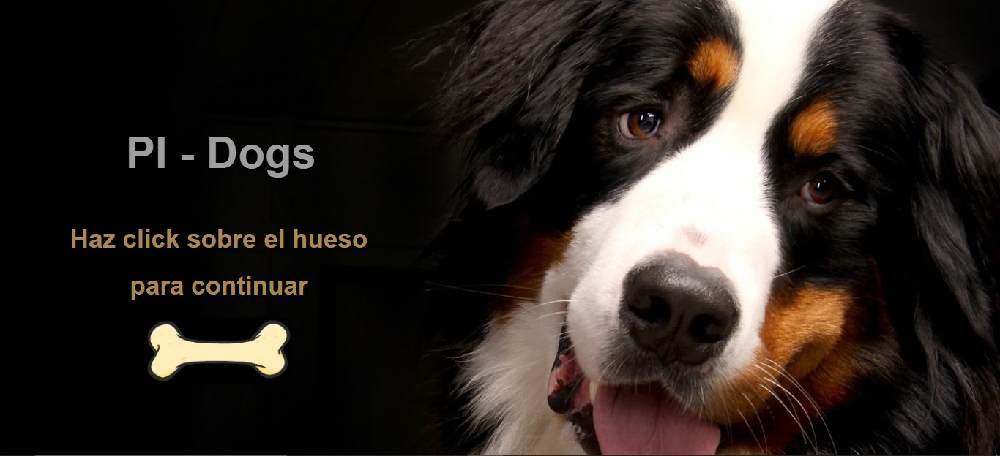
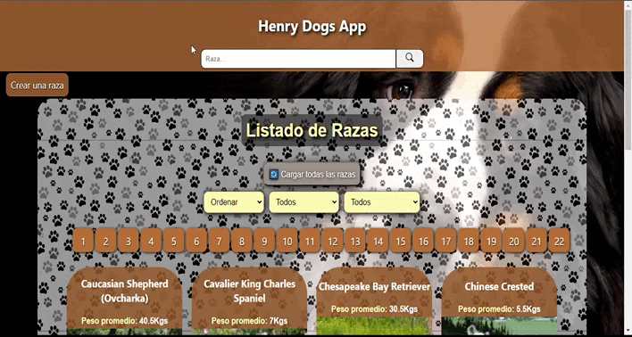
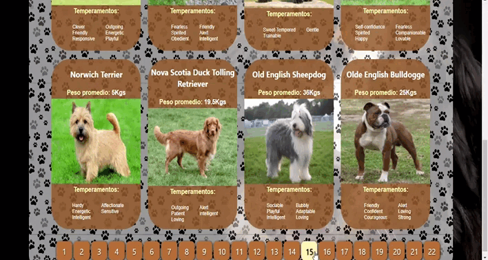
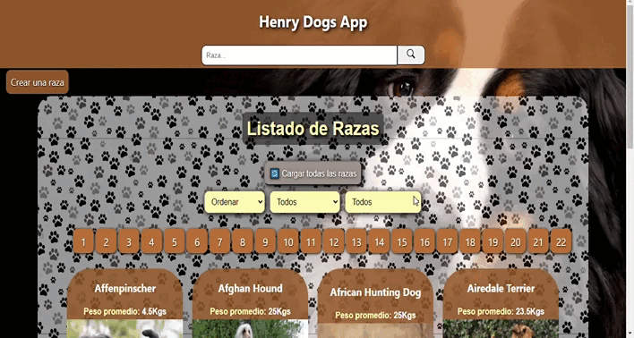

# Dogs

Se trata de un desafío del Bootcamp de [Henry](https://www.soyhenry.com/). Es una Single Page Application (SPA) basada en [TheDogApi](https://thedogapi.com/), con API y cliente personalizados.

El mismo debía ser preparado en un lapso de 3 semanas utilizando sólo las tecnologías aprendidas en dicho Bootcamp.

Este proyecto es solo una versión inicial, por lo que se puede actualizar en un futuro con nuevas funciones.

El cliente es una aplicación [React](https://reactjs.org/), con [React Router](https://reacttraining.com/react-router/web/guides/quick-start) y [Redux](https://redux.js.org/). API utiliza [Express](https://expressjs.com/), [Sequelize](https://sequelize.org/) y [PostgreSQL](https://www.postgresql.org/) como base de datos.

### Capturas de pantalla

Landing


Homepage



Filtrando


Ordenando por nombre y por peso


Buscando


Detalles de la raza



Creando una nueva raza



## Pasos para probar la SPA

### Configuración de la Base de Datos y el archivo `.env`

En primer lugar, debe crear una base de datos postgresql. Luego vaya a la carpeta `api`, cambie el nombre del archivo `.example.env` a `.env`, y complete las credenciales de la base de datos.

### Ejecutando localmente en modo desarrollador

Para comenzar, simplemente clone el repositorio y ejecute `npm install` y `npm start`:

```sh
git clone https://github.com/CrisCorzo97/Dogs-Proyect.git

cd ./api
npm install
npm start

cd ../client
npm install
npm start
```

Nota: Si está ejecutando Windows y tiene problemas con `fsevents`, ejecute `npm install --no-optional` que omitirá la instalación de fsevents.

### Construcción e implementación en producción

Si desea ejecutar este sitio en producción, debe instalar módulos y luego construir el sitio con `npm run build` y ejecutarlo con `serve`:

#### Linux & MacOS

```sh
cd ./client
npm install
npm run build

npm install -g serve
serve -s build
```

#### Windows

```sh
cd ./client
npm install
npm run build

npm install -g serve
serve -s build
```

Nota: debe ejecutar `npm run build` nuevamente cada vez que realice cambios en el sitio.

## Lista de acciones a realizar en la SPA

- [x] Landing
- [x] Homepage
  - [x] Filtro por raza
  - [x] Ordenar alfabéticamente y por peso
  - [x] Buscar raza/s
  - [x] Filtrar por temperamento
- [x] Ver detalles de cada raza
- [x] Crear una nueva raza
  - [x] Imagen personalizable
- [ ] Editar raza
- [ ] Eliminar raza
